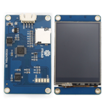
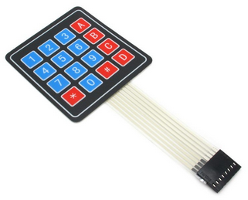

# esp32alarm
Alarm based on esp32 modules

## Description
Have a home alarm system using esp32 modules with some sensors. Central
monitoring will be running inside a raspberry pi 3 as a access point.
Using the raspberry will allow the creation of logs of events for future references

# Proyect questionnaire

|Item|Answer|
|----|-------|
|Name of the project|Home system alarm using ESP32 modules + Raspberry Pi 3|
|Description|Make an alarm home system using ESP32 modules and a Rasberry Pi 3 for processing and communication.|
|User interface|Main usage will be thorugh a telegram bot for activation and notifications|
|Stage 1.| Proof of concept using RCWL-0516 Human Body Detector Module|
|Stage 2.| Infrastructure design using Raspbian running in a Raspberry PI 3|
|Stage 3.| Armed and alarm through telegram |
|Stage 4.| Future: Interface support through Nextion NX3224T024 or Sealed Membrane 4X4 Button Pad|
|Stage 5.| Future: Siren home system|
|Hardware: Proximity Sensor|Human Body Detector Module, [RCWL-0516](https://www.crcibernetica.com/rcwl-0516-human-body-detector-module/)|
|Hardware: Alarm device|ESP32 [TTGO ESP32 with Lora and OLED Display (US915)](https://www.crcibernetica.com/ttgo-esp32-with-lora-and-oled-display-us915/)|
|Hardware: Management device|[Raspberry Pi 3 B+](https://www.crcibernetica.com/raspberry-pi-3-b-latest-version/)|
|Service|Telegram BOT|
|Software|Arduino, Raspbian, Ansible and Node-Red|
|Possible problems|Security design problems, actual traffic will be transfer through a hidden SSID protected with hard password over WPA2|

# Work

## Stage 1: PoC

### Proof of Concept (PoC)
Proof of concept using the human body present sensor.

Proof of concept will have the sensor connected and it will display a test
on the OLED once a motion is detected. The code will have support to enable
or disabled the OLED and a buzzer connected to the ESP32

## Stage 2: Infrastructure design

### Infrastructure design with Raspberry PI 3
Infrastructure running in a Raspberry Pi 3 and Raspbian a port of Debian.
The Raspberry Pi 3 will work as WIFI gateway for the ESP32 modules. Message
traffics are send to a MQTT (mosquitto) to the RPi3. Events will be process
by node-red.

## Stage 3: Alarm management

### Activation and events notification
Management of the alarm, activation and notification of events will
initially send through a Telegram BOT

## Stage 4: Physical interface management (Future)

### Touch screen or button pad support
Make a touch interface using a Nextion screen or using a sealed membrane to
enter a code to activate or disable the alarm system

 

## Stage 5: Siren home system (Future)

### Make a loud sound in case of the alarm is trigged
Using a Siren powered by a 12v battery. The Siren will be controlled by
another ESP32 module

